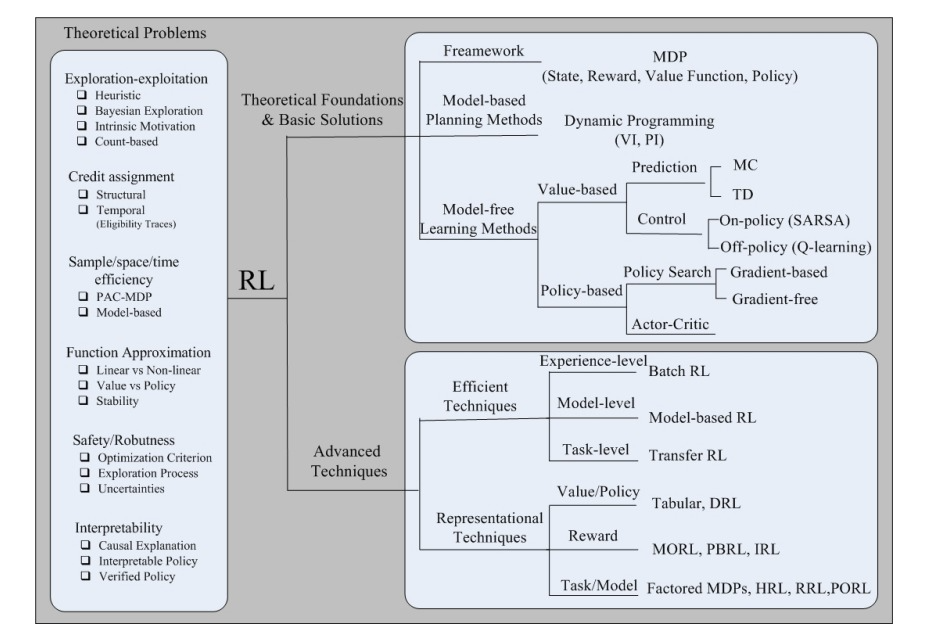
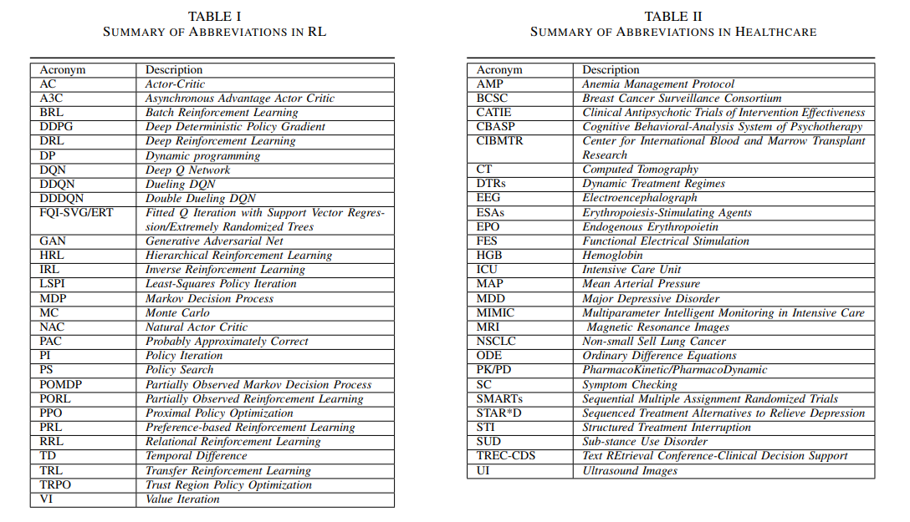
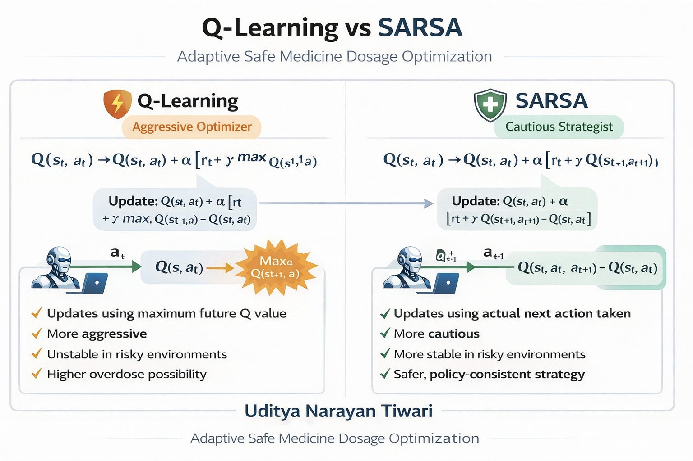

# 🏥 Adaptive Safe Medicine Dosage Optimization using Reinforcement Learning


---

---

## 📌 Overview

This project proposes a simulation-based reinforcement learning framework for safe medicine dosage optimization. A virtual patient environment is mathematically modeled to simulate infection progression, toxicity accumulation, and immunity dynamics.

The system compares two classical reinforcement learning algorithms:

* Q-Learning (Off-policy learning)
* SARSA (On-policy learning)

The goal is to analyze how different RL strategies behave in a safety-critical healthcare scenario involving trade-offs between treatment effectiveness and drug toxicity.

---
## 1. The summarization of theoretical foundations, basic solutions, challenging issues and advanced techniques in RL.




## 2. The outline of application domains of RL in healthcare


## 3. Important Common Terms In RL and HealthCare


---

## 🎯 Problem Statement

In medical treatment planning, selecting the correct dosage is critical.

* Higher dosage may reduce infection quickly but increase toxicity risk.
* Lower dosage may be safer but slow down recovery.

This project simulates a virtual patient and trains an RL agent to learn optimal dosage strategies while balancing:

* Infection reduction
* Toxicity control
* Safe recovery
* Overdose avoidance

---

## 🧠 Core Idea

We design a mathematical patient simulation model where:

State = (Infection Level, Toxicity Level, Immunity Level)

The RL agent learns a dosage policy that maximizes long-term patient recovery while minimizing harmful side effects.

---

## 🏗 System Architecture

```
── README.md
```

---

## 🔬 Simulation Model

### 1. State Variables

* Infection (0–100)
* Toxicity (0–100)
* Immunity (0–100)

### 2. Action Space

Discrete dosage levels:

* 0 mg
* 5 mg
* 10 mg
* 15 mg

### 3. State Transition Logic

At every time step:

* Infection decreases proportionally to dosage effectiveness.
* Toxicity increases proportionally to dosage strength.
* Immunity changes dynamically.
* Random noise introduces stochastic behavior.

This creates a realistic trade-off between fast recovery and safety.

---

## 🏆 Reward Function

The reward system is designed to encourage safe and effective treatment:

* Positive reward for infection reduction
* Large reward for full recovery
* Negative reward for toxicity increase
* Heavy penalty for overdose
* Small penalty per time step

This ensures the agent learns balanced treatment strategies.

---

## 🤖 Algorithms Used

### 1. Q-Learning

* Off-policy learning
* Updates using maximum future Q-value
* Typically more aggressive
* May choose higher dosage for faster recovery

### 2. SARSA

* On-policy learning
* Updates using next selected action
* More cautious behavior
* Safer treatment policy

<!--  -->

---

## 📊 Evaluation Metrics

The following metrics are used to compare both algorithms:

* Average reward per episode
* Recovery rate (%)
* Overdose rate (%)
* Convergence speed
* Policy stability


---

## 🚀 Novelty of This Project

While Reinforcement Learning has been used in healthcare research, this project introduces several unique aspects:

###  1. Risk Sensitivity Comparison

Most healthcare RL research focuses on deep reinforcement learning.
This project explicitly compares Q-Learning and SARSA in a safety-critical medical environment.

###  2. Safety-Oriented Reward Design

Unlike performance-focused optimization models, this system emphasizes:

* Toxicity constraints
* Safe recovery
* Risk-aware learning

###  3. Explainable and Educational Framework

* Fully mathematical simulation
* Transparent decision-making
* Easy to visualize and interpret
* Suitable for academic and research purposes

###  4. Explicit Trade-off Modeling

The environment intentionally models the conflict between:

- Fast recovery vs Treatment safety

- This makes policy behavior analysis possible.

---

## 📈 Expected Observations

* Q-Learning may converge faster but take higher risks.
* SARSA may learn safer policies with lower overdose probability.
* Healthcare scenarios may favor safer on-policy methods.

---

## 🛠 Technologies Used

* Python
* NumPy
* Matplotlib
* Reinforcement Learning (Tabular Methods)

---

## 📌 Conclusion

This project demonstrates how classical reinforcement learning algorithms behave in a safety-critical healthcare environment.

By comparing aggressive and cautious learning strategies, the system provides insight into:

* Risk-sensitive AI decision making
* Safe treatment planning
* Explainable healthcare reinforcement learning


<!--  -->
---

## 📚 Related Work

The following works inspired this study:

1. **Reinforcement Learning in Healthcare: A Survey**.
   [https://arxiv.org/pdf/1908.08796.pdf](https://arxiv.org/pdf/1908.08796.pdf)

2. **Drug Dosage Control System Using Reinforcement Learning. IJISRT (2024)**.
   [https://www.ijisrt.com/assets/upload/files/IJISRT24APR505.pdf](https://www.ijisrt.com/assets/upload/files/IJISRT24APR505.pdf)

3. **Simulation-based Optimization of Chemotherapeutic Drug Dosage: Q-learning Approach.**
   [https://oiccpress.com/ijbbe/article/view/10838](https://oiccpress.com/ijbbe/article/view/10838)

---

## 👨‍💻 Author

Uditya Narayan Tiwari

B.Tech CSE (AI & ML) **VIT Bhopal University**
